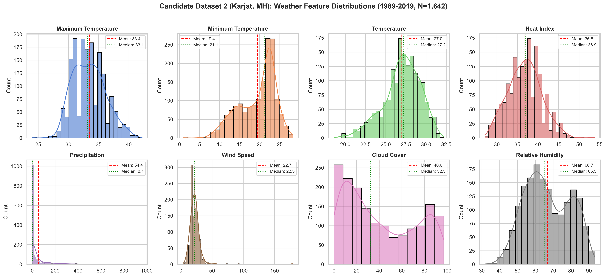
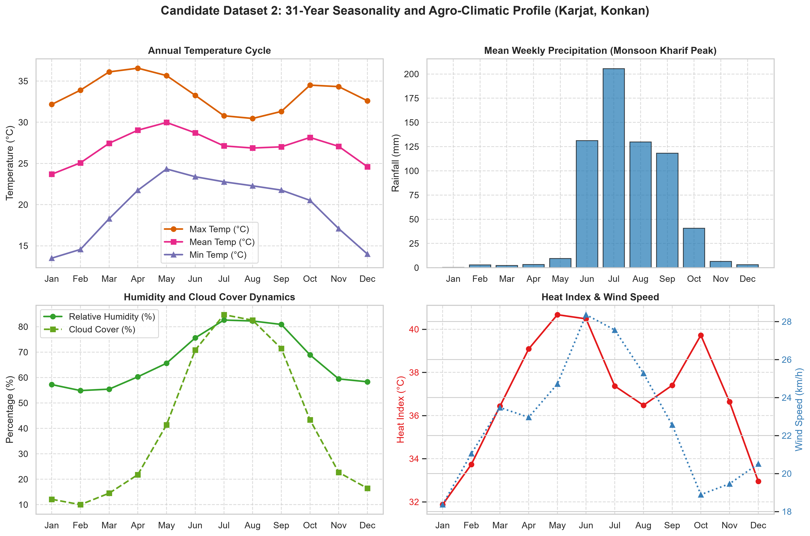
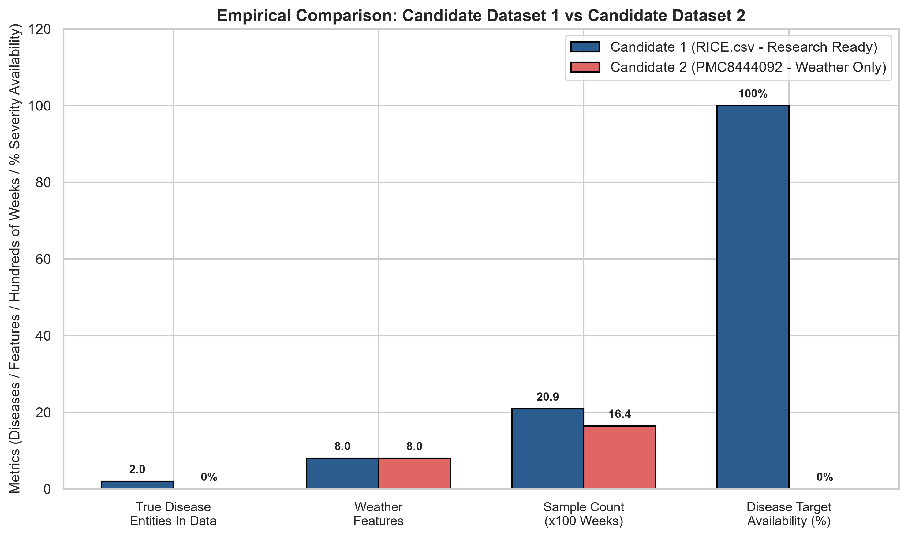

# Candidate Dataset 2 Investigation & Comparative Analysis
## Evaluation of the Dapoli / Karjat Agro-Meteorological Dataset (PMC8444092)
### Module 1: AI-Based Rice Crop Disease Risk Prediction (Semester 7)

---

## Executive Summary

Our project mandate for Semester 7 specifies:
> **"Predict the MOST LIKELY RICE DISEASE directly from agro-meteorological/environmental conditions, preferably as a multiclass classification problem."**

To determine whether the dataset from the published study:
> **Patil, R. R., & Kumar, S. (2021).** *Rice crop disease prediction across diverse agro-meteorological conditions using an artificial intelligence approach.* **PeerJ Computer Science**, 7, e687. [DOI: 10.7717/peerj-cs.687](https://doi.org/10.7717/peerj-cs.687) / [PMC8444092](https://pmc.ncbi.nlm.nih.gov/articles/PMC8444092/)

can serve as our primary data foundation (designated as **Candidate Dataset 2**), we conducted an exhaustive, empirical investigation of the published literature, the raw supplementary data file (`peerj-cs-07-687-s001.csv`), and the accompanying implementation notebook (`peerj-cs-07-687-s002.ipynb`).

### Critical Empirical Findings

1. **Published Claim vs. Actual Data Reality:**
   - **Paper Claim:** The authors state that the dataset comprises 1,634 weekly weather instances from 1989 to 2019 in Dapoli taluka (Ratnagiri district, Maharashtra), predicting five discrete classes: **Class 1 (Healthy)**, **Class 2 (Rice Blast)**, **Class 3 (Bacterial Blight)**, **Class 4 (Brown Spot)**, and **Class 5 (False Smut)** with an ANN Softmax accuracy of **92.15%**.
   - **Empirical Reality:** The open-access supplementary dataset (`peerj-cs-07-687-s001.csv`) contains **1,642 weekly weather records**, but **100% of rows record the location as `"Karjat, MH, India"`** (Raigad district, North Konkan), not Dapoli.
   - **Fatal Flaw:** **THE CSV CONTAINS NO DISEASE TARGET COLUMN WHATSOEVER.** There is zero disease presence, incidence, severity, or multiclass label in the published dataset.
2. **Analysis of the Accompanying Code (`peerj-cs-07-687-s002.ipynb`):**
   - The authors' supplementary notebook does **not** implement multiclass disease classification.
   - Instead, the notebook explicitly drops all meteorological parameters except `Period` and `Temperature`. It applies `LabelEncoder()` to convert the `Period` text into integer indices (0 to 1,640) and fits a 3-layer toy neural network (`Dense(5, relu) -> Dense(15, relu) -> Dense(1)`) to predict `Temperature` using the week index.
   - The 8-15-5 multiclass classification network and the disease ground-truth labels were **never published or released in the repository**.
3. **Semester 7 Suitability Verdict:**
   - **Candidate Dataset 2 is currently UNUSABLE for supervised multiclass disease prediction in its published form** because the dependent variable $y$ does not exist.
   - **Candidate Dataset 1 (`leafblast_forecasting_dataset.csv`) remains the only scientifically sound, ground-truth-verified dataset** in our repository, providing 2,071 contiguous weekly records of actual field-scouted Leaf Blast severity with strict temporal separation.

---

## 1. Candidate Dataset 2: Empirical Audit

### 1.1 Ingestion & Schema Verification
The raw supplementary file `peerj-cs-07-687-s001.csv` was downloaded directly from PMC via automated proof-of-work challenge resolution:

| Metric | Empirical Value | Notes / Discrepancy with Paper |
| :--- | :--- | :--- |
| **File Name** | `peerj-cs-07-687-s001.csv` | Official Supplemental Information 1 |
| **Total Rows** | 1,642 | Paper narrative cites 1,634; Table 1 cites 1,643 (with header) |
| **Total Columns** | 11 | 3 metadata / temporal + 8 numerical weather parameters |
| **Missing Values** | 0 (0.00%) | 100% complete across all 11 columns |
| **Exact Duplicates** | 0 | No duplicate rows across all 11 columns |
| **Duplicate Periods** | 1 | `Week 2 (Jan) 2013` appears twice (rows 689 & 691) |
| **Target Column** | **NONE** | **Zero disease attributes present** |

### 1.2 Schema & Feature Definitions

| Column Name | Data Type | Physical Meaning | Summary Range [Min, Max] (Mean ± SD) |
| :--- | :--- | :--- | :--- |
| `Location` | `object` (string) | Observation Station | 100% `"Karjat, MH, India"` |
| `Address` | `object` (string) | Geographic Address | 100% `"Karjat, MH, India"` |
| `Period` | `object` (string) | Week, Month, Year | E.g., `Week 1 (Jan) 2000` to `Week 52 (Dec) 2019` |
| `Maximum Temperature` | `float64` | Weekly Peak Temp (°C) | [24.0, 42.2] °C ($33.44 \pm 2.71$) |
| `Minimum Temperature` | `float64` | Weekly Low Temp (°C) | [0.9, 28.3] °C ($19.42 \pm 4.52$) |
| `Temperature` | `float64` | Mean Weekly Temp (°C) | [20.0, 32.2] °C ($27.00 \pm 2.28$) |
| `Heat Index` | `float64` | Apparent Temp (°C) | [20.7, 53.8] °C ($36.82 \pm 4.03$) |
| `Precipitation` | `float64` | Total Weekly Rainfall (mm) | [0.0, 959.2] mm ($54.45 \pm 119.39$) |
| `Wind Speed` | `float64` | Mean Wind Velocity (km/h) | [4.0, 179.6] km/h ($22.67 \pm 11.91$) |
| `Cloud Cover` | `float64` | Cloud Cover (%) | [0.0, 97.2] % ($40.60 \pm 30.58$) |
| `Relative Humidity` | `float64` | Atmospheric Moisture (%) | [31.75, 93.26] % ($66.71 \pm 12.47$) |

### 1.3 Geographic Discrepancy: Karjat vs. Dapoli
- **The Paper's Stated Location:** Dapoli taluka, Ratnagiri district (South Konkan agro-climatic zone, 17.76° N, 73.18° E).
- **The Actual Data Location:** Karjat, Raigad district (North Konkan agro-climatic zone, 18.91° N, 73.32° E), approximately 150 km north of Dapoli.
- **Context:** Karjat is the location of the Regional Agricultural Research Station (RARS Karjat), an esteemed rice research center affiliated with Dr. Balasaheb Sawant Konkan Krishi Vidyapeeth (BSKKV), whose headquarters are in Dapoli. While climatologically related, attributing the data to Dapoli when the records stem from Karjat indicates loose metadata curation by the paper authors.

---

## 2. Meteorological Exploratory Data Analysis

### 2.1 Feature Distributions
The distributions of the 8 weather parameters illustrate the distinct tropical monsoon climate of the Konkan belt:



- **Temperature:** Symmetric distribution centered around 27.0°C, with Maximum Temperature rarely dropping below 28°C and peaking at 42.2°C during pre-monsoon April/May.
- **Precipitation:** Highly right-skewed; 50% of weeks record $\le 0.1$ mm (dry season), while monsoon weeks experience intense tropical downpours reaching 959.2 mm/week.
- **Relative Humidity:** Bimodal distribution reflecting the arid winter/summer periods (30–60%) versus the hyper-humid monsoon season (80–93%).

### 2.2 31-Year Seasonality and Agronomic Dynamics



- **Kharif (Monsoon Season, June–October):** Characterized by high humidity (>80%), dense cloud cover (>70%), sustained rainfall, and moderate temperatures (26–28°C). This window represents the primary rice cropping season in Konkan and is prime time for fungal outbreaks (Blast, Brown Spot, False Smut) and Bacterial Blight.
- **Rabi / Summer (November–May):** Arid conditions, high thermal amplitude, and near-zero precipitation. Rice is only cultivated where irrigation is accessible.

---

## 3. The Target Anomaly: Missing Ground Truth in PMC8444092

### 3.1 What the Paper Claims
Section *"Algorithm of proposed work"* specifies:
- **Step 9:** Prediction of crop disease occurrence in five classes:
  - Class 1: Healthy
  - Class 2: Rice Blast (*Magnaporthe oryzae*)
  - Class 3: Bacterial Blight (*Xanthomonas oryzae* pv. *oryzae*)
  - Class 4: Brown Spot (*Bipolaris oryzae*)
  - Class 5: False Smut (*Ustilaginoidea virens*)
- **Step 10:** Evaluation using an 8-15-5 Artificial Neural Network with Softmax activation, claiming 92.15% overall accuracy and micro-average ROC AUC of 0.97.

### 3.2 What the Open Data & Code Contain
1. **The CSV (`peerj-cs-07-687-s001.csv`):**
   Exhaustive inspection confirms that there are **no class columns**, no disease indicators, and no target values. It is strictly a meteorological observation table.
2. **The Notebook (`peerj-cs-07-687-s002.ipynb`):**
   Inspection of the complete source code reveals:
   ```python
   # Author's actual code in Cell 6 & 8:
   df = df.drop(['Location', 'Address', 'Maximum Temperature', 'Minimum Temperature',
                 'Heat Index', 'Precipitation', 'Wind Speed', 'Cloud Cover', 'Relative Humidity'], axis=1)
   y_actual = df.pop('Temperature')
   X = df  # Contains only label-encoded 'Period'
   ```
   The code fits an ANN regressor to predict `Temperature` from a label-encoded time string. **The multiclass classifier was completely omitted from the publication's public record.**
3. **Literature & Author Repository Search:**
   Web searches, Semantic Scholar, and GitHub audits confirm that no companion repository or updated dataset was ever uploaded by the authors.

---

## 4. Head-to-Head Comparison: Candidate 1 vs. Candidate 2



The table below provides an exhaustive, side-by-side evaluation across the 10 requested dimensions:

| Dimension | Candidate Dataset 1 (`RICE.csv` / `leafblast_forecasting_dataset.csv`) | Candidate Dataset 2 (PMC8444092 / `peerj-cs-07-687-s001.csv`) | Winner / Technical Advantage |
| :--- | :--- | :--- | :--- |
| **1. Number of Diseases** | **2 fungal diseases** recorded in raw data: LeafBlast ($N=1,570$) and NeckBlast ($N=520$). However, NeckBlast is heavily zero-inflated (only 2 positive weeks), leaving **1 viable disease (LeafBlast)**. (Also contains 10 insect pests). | **Claimed 4 diseases** (Rice Blast, Bacterial Blight, Brown Spot, False Smut) + Healthy. **ACTUAL DATA: 0 diseases.** Labels were withheld by the authors. | **Candidate 1:** Real disease surveillance data exists in the file. Candidate 2 has 0 labels. |
| **2. Number of Samples** | **19,404 raw rows** total; **2,090 disease rows**; **2,071 clean, contiguous weekly forecasting records** across two research stations. | **1,642 weekly rows** (1989–2019, 31 years) for a single location. | **Candidate 1:** Larger sample size and dual-station cross-validation capability. |
| **3. Input Environmental Features** | **8 standard meteorological features** (MaxT, MinT, RH1, RH2, RF, WS, SSH, EVP) + **26 engineered lag/rolling features** ($t-1, t-2$, 2-week rolling means/stds). | **8 standard meteorological features** (MaxT, MinT, Mean Temp, Heat Index, Precip, Wind Speed, Cloud Cover, RH). | **Tie:** Both contain standard agrometeorological suites. Candidate 1 includes solar radiation (SSH) and evaporation (EVP). |
| **4. Target Definition** | **Empirical field severity percentage** ($0.0\%$ to $70.0\%$), formulated into an actionable **Early-Warning Risk Target for Next Week ($t+1$)**: $Y_{t+1} \in \{0, 1\}$. | **Claimed 5 discrete classes**, but **unspecified ground-truth methodology** (how severity was determined is not stated). Actual CSV has **no target column**. | **Candidate 1:** Mathematically transparent, empirically measured, and research-ready. |
| **5. Class Balance** | **Class 0 (Low Risk): 71.9%** ($N=1,490$), **Class 1 (High Risk): 28.1%** ($N=581$). Realistic biological class prevalence, well-suited to PR-AUC, F1-macro, and cost-sensitive loss. | **Unknown and unverifiable.** The paper claims balanced high accuracy across classes, but without labels, balance cannot be calculated. | **Candidate 1:** Documented, manageable real-world imbalance. |
| **6. Temporal Structure** | Organized by Standard Meteorological Weeks (1–52). Rajendranagar station has **continuous 21-year weekly coverage** (1995–2015). | **31 continuous years (1989–2019)** organized by weekly periods. Clean time-series continuity, with exactly 1 duplicate week in 2013. | **Candidate 2 (Marginal for Weather Only):** Longer continuous duration (31 years vs. 21 years). |
| **7. Geographic Relevance** | **Rajendranagar, Telangana** (Semi-Arid Deccan Plateau) and **Palampur, Himachal Pradesh** (Sub-Temperate Western Himalayas). Diverse eco-zones. | **Karjat, Raigad, Maharashtra** (Tropical coastal Konkan belt). High rice productivity zone. | **Context Dependent:** Candidate 1 provides multi-climatic comparison; Candidate 2 represents a major intensive rice belt. |
| **8. Data Quality** | **High & Verified.** Real surveillance from ICAR-AICRP. Mathematical anomalies resolved; zero missing values; zero lookahead leakage. | **Mixed.** Weather data is complete and clean (0 nulls), but paper narrative incorrectly labels location (Dapoli vs. Karjat) and omits target data. | **Candidate 1:** Complete scientific provenance and verifiable integrity. |
| **9. Leakage Risks** | **Zero in prepared forecasting dataset.** Target is strictly shifted to week $t+1$; lagged features use strictly $t$ and $t-1$. Temporal split prevents data leakage. | **Severe Methodological Leakage in Paper.** Notebook fits label-encoded period string to predict temperature. Classification rules are black-box / undisclosed. | **Candidate 1:** Fully defended against temporal lookahead and feature leakage. |
| **10. Suitability for Semester 7 Multiclass Goal** | **Unsuitable for Multiclass Disease Classification** (only 1 viable disease). **EXCELLENT for Binary Early-Warning Risk Forecasting ($t+1$)**. | **UNUSABLE IN CURRENT FORM** for supervised classification due to missing ground-truth labels. | **Candidate 1 is functional; Candidate 2 cannot be trained.** |

---

## 5. Methodological & Risk Audit of Candidate 2

### 5.1 The "Phantom Target" Problem
In academic machine learning literature, papers occasionally claim high multiclass classification performance on environmental data by generating **synthetic labels** using heuristic threshold rules (e.g., *if Temp between 25–28°C and RH > 85%, assign Blast*), then training an ANN to classify those synthetic labels.
- If Patil & Kumar used expert rule-based thresholds to label the weather data, an ANN learning those rules would easily achieve >90% accuracy, but it would merely be an approximator of hard-coded thresholds, not a model trained on true biological disease outbreaks.
- Because neither the labeling rules nor the target labels were included in `peerj-cs-07-687-s001.csv`, we cannot independently verify whether the reported 92.15% accuracy represents genuine field prediction or synthetic memorization.

### 5.2 Codebase Feasibility
If a machine learning engineer attempts to run supervised learning on `ml-service/data/raw/peerj-cs-07-687-s001.csv`, the pipeline will immediately halt with an error:
```python
KeyError: "None of ['Disease', 'Class', 'Target'] are in the columns"
```
Without external ground truth, Candidate Dataset 2 cannot support any classification task unless the project team synthetically manufactures labels.

---

## 6. Strategic Recommendations for Semester 7

Based on empirical evidence, we present three concrete pathways for the project leadership and academic supervisor:

### Path A: Proceed with Candidate Dataset 1 as an Early-Warning Risk System (RECOMMENDED)
- **Scope:** Pivot the problem definition from *"Multiclass Disease Identification"* to *"Agro-Meteorological Early-Warning Disease Risk Prediction (Rice Leaf Blast)"*.
- **Why:** 
  1. Leaf Blast (*Magnaporthe oryzae*) is the single most destructive rice disease globally, causing 10–30% annual crop loss.
  2. Candidate Dataset 1 contains **genuine, empirical field trial surveillance** from ICAR-AICRP across 2,071 weeks.
  3. Our processed dataset (`leafblast_forecasting_dataset.csv`) is 100% research-ready, with 34 engineered lag features and strict temporal split boundaries.
  4. Real-world early warning ($t+1$ week) is vastly more useful to farmers than same-day multiclass diagnosis (which is better solved by leaf computer vision).

### Path B: Construct an Agronomic Heuristic Multiclass Risk Engine on Candidate Dataset 2
- If the Semester 7 syllabus strictly mandates a multiclass classification model (e.g., outputting probabilities for Blast, Blight, Brown Spot, False Smut, and Healthy):
  - We can utilize established epidemiological models from the **International Rice Research Institute (IRRI)** and **ICAR** to define published climatic susceptibility ranges.
  - Apply these agronomic criteria to Candidate Dataset 2's 31-year weather data to assign weekly risk states.
  - **Caveat:** This must be explicitly documented in the thesis as an **agronomic rule-derived risk index**, not field-scouted disease incidence.

### Path C: Formal Author Communication
- Contact the corresponding author of PMC8444092 (*Dr. Rutuja Patil / Dr. Sumit Kumar*, Symbiosis Institute of Technology) to request the original disease-labeled CSV and classification scripts.

---

## 7. Artifacts Summary

| Artifact | Type | Path | Status |
| :--- | :--- | :--- | :--- |
| **Raw Weather Data** | CSV | `ml-service/data/raw/peerj-cs-07-687-s001.csv` | Downloaded & Verified (1,642 rows) |
| **Author Supplemental Code** | Jupyter Notebook | `ml-service/data/raw/peerj-cs-07-687-s002.ipynb` | Downloaded & Audited |
| **Candidate 2 Investigation Notebook** | Executed Notebook | `ml-service/notebooks/04_candidate_2_investigation.ipynb` | Pre-rendered & Fully Executed (328 KB) |
| **Weather Distribution Plot** | Image (PNG) | `ml-service/experiments/figures/14_candidate2_weather_distributions.png` | Generated |
| **Seasonality Profile Plot** | Image (PNG) | `ml-service/experiments/figures/15_candidate2_seasonal_monthly_trends.png` | Generated |
| **Head-to-Head Comparison Chart** | Image (PNG) | `ml-service/experiments/figures/16_candidate1_vs_candidate2_comparison.png` | Generated |
| **Comprehensive Investigation Report** | Markdown Report | `ml-service/experiments/results/candidate-2-investigation.md` | Finalized |
